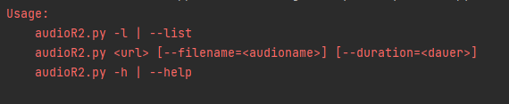
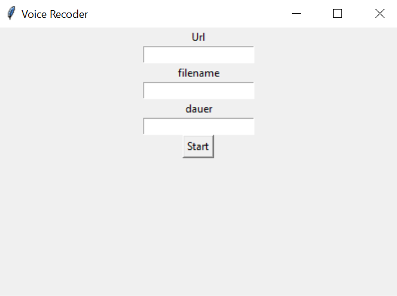

# Audiorecorder 
With the help of the audio recorder you can record mp3 streams from the Internet 
for exemple

with different Users interfaces (UIs)
1. Command-line interface (CLI)
2. GUI with Tkinter







## How to run the Audiorecorder 
1. Clone this repository  
2. RUN :

with
```cmd 
 python .\AudioRecorderTkinter.py 
```
or

```cmd 
 python .\AudioRecorderCLI.py here the link --filename=nyAudo.mp3 --duration=22
```
